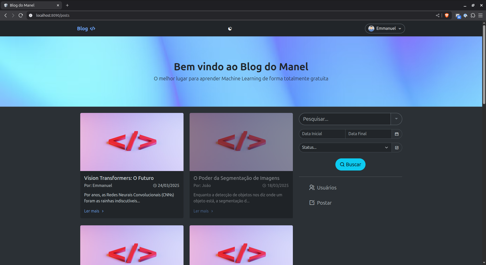
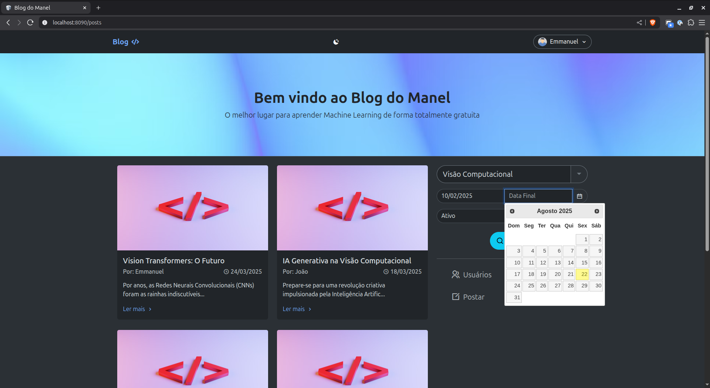
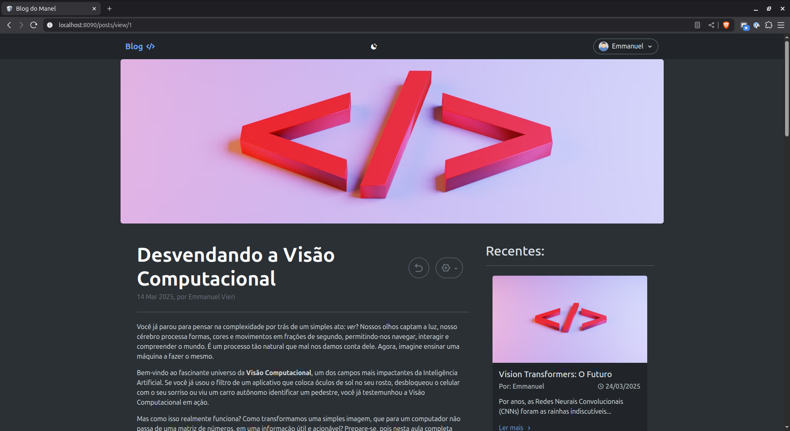
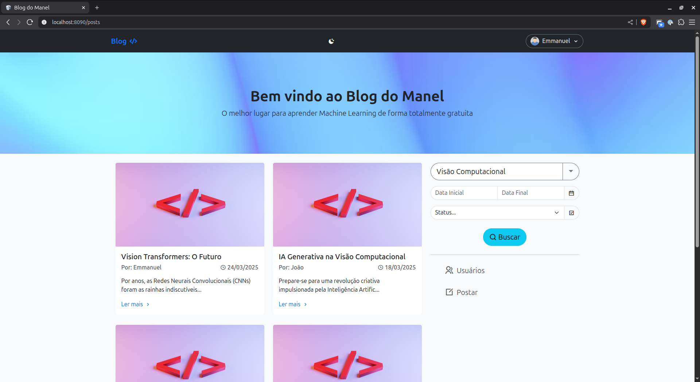
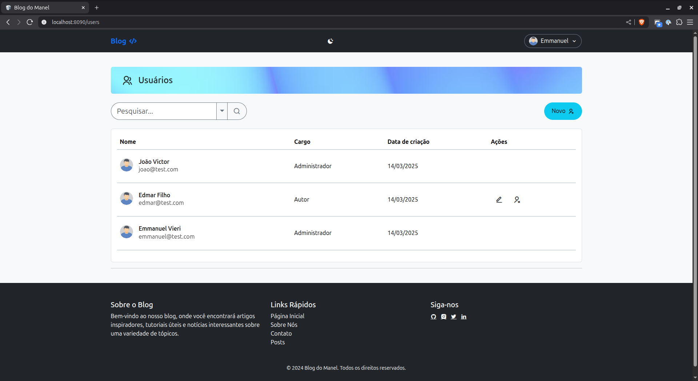
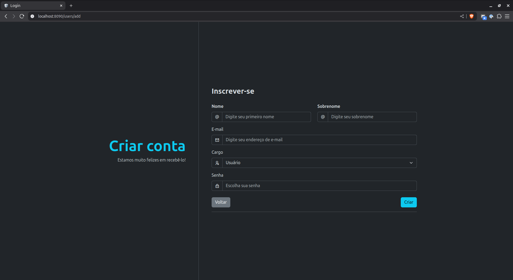

# 📝 Blog CakePHP 2.10 - Template Completo

Um **template completo de blog** desenvolvido com **CakePHP 2.10**, apresentando sistema robusto de gerenciamento de conteúdo, interface moderna e arquitetura profissional com Docker. **Pronto para ser customizado** para qualquer nicho ou propósito.

## 🚀 Funcionalidades

### 👥 Sistema de Usuários
- **Autenticação segura** com sessões PHP
- **Níveis de acesso**: Administrador e Usuário padrão
- **Gerenciamento completo** de usuários (CRUD)
- **Controle de permissões** por tipo de usuário

### 📰 Gerenciamento de Posts
- **CRUD completo** para artigos/posts
- **Ativar/Desativar** posts sem exclusão
- **Sistema de status** (Ativo/Inativo)
- **Editor flexível** para qualquer tipo de conteúdo

### 🔍 Sistema de Busca e Filtros
- **Pesquisa avançada** por título e conteúdo
- **Filtro por data** com calendário interativo (jQuery)
- **Filtro por status** (Ativo/Inativo)
- **Persistência de filtros** via sessão PHP

### 🎨 Interface e UX
- **Tema claro e escuro** com localStorage
- **Ícones dinâmicos** (Remix Icons)
- **Design responsivo** com Bootstrap 5
- **Paginação otimizada**
- **Calendário interativo** para seleção de datas

### ⚙️ Infraestrutura
- **Containerização** completa com Docker
- **PostgreSQL** como banco de dados
- **Ambiente de desenvolvimento** isolado e replicável

## 🛠️ Tecnologias Utilizadas

### Backend
- **CakePHP 2.10** - Framework PHP MVC
- **PostgreSQL** - Sistema de gerenciamento de banco
- **PHP Sessions** - Autenticação e persistência de filtros

### Frontend
- **Bootstrap 5** - Framework CSS responsivo
- **jQuery** - Manipulação DOM e calendário
- **JavaScript Vanilla** - Alternância de temas
- **Remix Icons** - Biblioteca de ícones moderna
- **CSS3** - Estilização customizada

### DevOps
- **Docker** - Containerização
- **Docker Compose** - Orquestração de containers

## 📋 Pré-requisitos

- Docker
- Docker Compose
- Git

## 🚀 Instalação e Primeira Execução

### 1. Clone o repositório
```bash
git clone [seu-repositorio]
cd blog-cakephp-template
```

### 2. Execute com Docker
```bash
docker-compose up -d
```

### 3. Configuração inicial do banco
```bash
# O banco será criado automaticamente vazio
# Execute as migrations ou crie manualmente as tabelas necessárias
```

### 4. Acesse a aplicação
- **Blog**: http://localhost:8080
- **Área Admin**: http://localhost:8080/admin (após criar usuário admin)

### 5. Primeiro usuário administrador
- Acesse `/users/add` para criar o primeiro usuário
- Defina o role como 'admin' no banco de dados

## 📸 Screenshots

### Gerenciamento de Artigos

*CRUD completo para artigos técnicos de Machine Learning*

### Sistema de Filtros com Calendário

*Filtros avançados com calendário jQuery para busca por data*

### Blog Público - Artigos de ML/CV

*Interface pública mostrando artigos sobre Machine Learning e Visão Computacional*

### Tema Claro/Escuro com Remix Icons

*Alternância de temas com ícones dinâmicos do Remix Icons*

### Sistema de Gerenciamento de Usuários

*Listagem detalhada de usuários com opção de edição para administradores.*

### Interface convidativa para adição de usuários

*Tela de cadastro de novos usuários cativante*

### Interface Responsiva


*Layout adaptável para leitura de artigos técnicos em mobile*

## 🏗️ Arquitetura

### Estrutura MVC (CakePHP 2.10)
```
app/
├── Controller/
│   ├── PostsController.php      # Gestão de posts/artigos
│   ├── UsersController.php      # Gestão de usuários
│   ├── AppController.php        # Controlador base
│   └── PagesController.php      # Renderiza páginas estáticas
├── Model/
│   ├── AppModel.php             # Model base
│   ├── Post.php                 # Model dos posts
│   └── User.php                 # Model dos usuários
└── View/
    ├── Posts/                   # Views dos posts
    ├── Users/                   # Views dos usuários
    ├── Errors/                  # Mensagens de erro customizadas
    └── Layouts/                 # Templates base
```

### Schema do Banco de Dados
```sql
-- Tabela de posts (conteúdo flexível)
posts: id, title, body, created, user_id, category_id, status

-- Usuários do sistema  
users: id, username, password, role, name, surname, created
```

## 🔧 Funcionalidades Técnicas

### Gerenciamento de Estado
- **Sessões PHP** para filtros de pesquisa persistentes
- **localStorage** para preferências de tema
- **Validação** automática de formulários

### Interface Interativa
- **Calendário jQuery** para seleção intuitiva de datas
- **Alternância de temas** com JavaScript vanilla
- **Ícones dinâmicos** que se adaptam ao tema
- **Feedback visual** imediato para ações

### Segurança CakePHP 2.10
- **Auth Component** configurado
- **Security Component** para proteção CSRF
- **Sanitização automática** de inputs
- **Validação robusta** server-side

## 🎯 Template Flexível

### 🔧 Fácil Customização
- **Estrutura MVC** bem organizada
- **Views modulares** e reutilizáveis
- **CSS bem comentado** para fácil modificação
- **Configurações centralizadas**

### 📊 Pronto para Qualquer Nicho
- Blog pessoal ou corporativo
- Portal de notícias
- Base de conhecimento
- Documentação técnica
- Qualquer sistema de conteúdo

### 🎨 Design System Completo
- **Bootstrap 5** como base sólida
- **Remix Icons** para consistência visual
- **Temas claro/escuro** pré-configurados
- **Tipografia** otimizada para leitura

## 💡 Começando Seu Projeto

### 1. **Personalize o Visual**
```css
/* /webroot/css/custom.css */
:root {
  --cor-base: #sua-cor;
  --cor-secundaria: #sua-cor-secundaria;
}
```

### 2. **Configure seu Domínio**
```php
// /app/Config/core.php
Configure::write('App.baseUrl', 'https://seublog.com');
```

### 3. **Customize as Views**
- Edite `/app/View/Layouts/default.ctp` para sua marca
- Modifique `/app/View/Posts/index.ctp` para seu estilo
- Adicione campos personalizados conforme necessário

### 4. **Adicione Funcionalidades**
- Comentários nos posts
- Categorias/tags
- Upload de imagens
- SEO otimizado

## 📈 Vantagens Técnicas

- **CakePHP 2.10** - Framework maduro e estável
- **PostgreSQL** - Banco robusto para produção
- **Docker Ready** - Deploy simplificado
- **Código limpo** - Fácil manutenção
- **Bem documentado** - Desenvolvimento ágil

## 🐳 Container Pronto para Produção

### Configuração Docker Otimizada
```yaml
# docker-compose.yml incluso
services:
  app: # Apache + PHP + CakePHP
  db:  # PostgreSQL
```

### Variáveis de Ambiente
```env
# .env.example fornecido
DATABASE_URL=postgresql://user:pass@db:5432/blog
DEBUG_MODE=false
```

## 🤝 Para Desenvolvedores

### 💻 Stack Moderna
- Framework PHP maduro (CakePHP 2.10)
- Frontend responsivo (Bootstrap 5)
- JavaScript estratégico (jQuery + Vanilla)
- Containerização completa (Docker)

### 🏆 Boas Práticas Implementadas
- **MVC** bem estruturado
- **Separation of Concerns**
- **DRY** (Don't Repeat Yourself)
- **Security First**
- **Mobile First**

### 🔍 Código Auditável
- Comentários em português
- Estrutura clara e lógica
- Padrões de nomenclatura consistentes
- Fácil debugging e manutenção

## 📞 Suporte e Customização

Este template demonstra proficiência em:
- **Desenvolvimento Full Stack** com PHP
- **Arquitetura MVC** bem estruturada
- **Design Patterns** e boas práticas
- **DevOps** com containerização
- **UX/UI** moderna e acessível

---

**Template Blog CakePHP 2.10** - Sua base sólida para qualquer projeto de conteúdo! 🚀

Desenvolvido por **Emmanuel Vieri**
- 📧 Email: emmanuel.vieri@gmail.com
- 💼 [LinkedIn](linkedin.com/in/emmanuel-vieri-b1878b189)
- 🐱 [GitHub](github.com/evieri)

*Especializado em desenvolvimento web com foco em machine learning e visão computacional.*